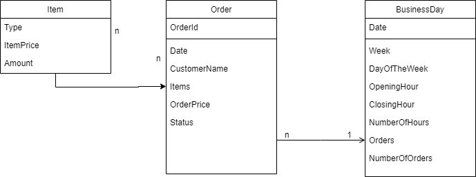

# Restaurant-Interface

## Running the application
The application is not fully functional.

### Frontend
From the root directory:
1. Enter the `frontend` directory using: `cd frontend`.
2. Run the frontend using: `yarn start`.
3. Use "Inspect" -> "Console" in your browser to se responses from pressing the "Apply" button.

#### Screenshot - Orders

### Backend
From the root directory:
1. Enter the `mysite` directory using: `cd mysite`.
2. Create a conda environment using: `conda create --name <env name>` (see mysite/README.md for details).
3. Activate the conda environment using: `conda activate <env name>`.
4. Install pip using: `conda install pip`.
5. Install required packages using: `pip install -r requirements.txt`.
6. Run `python manage.py makemigrations`.
7. Run `python manage.py migrate`.
8. Run `python manage.py runserver`.
9. Follow the link to the locally hosted server (see terminal).
10. Add `/admin/` to see the admin page.
11. Add `/api/` to see an overview of the API endpoints.

The api endpoints are not functional, so there will appear a bunch of error messages.
To understand the application use cases, look in the `frontend -> src -> services` directory to see all the frontend API calls.

#### Screenshot - API Overview

---

## Explanation
The goal is to provide the customer with a restaurant interface, which contains tools to help administer opening hours, order management and providing relevant statistics.

## Solution
Divide the application into 3 pages, each covering its own functional requirement, with routing between the pages:
- `Hours`
- `Orders`
- `Statistics`

### Technology
Frontend: TypeScript/React using yarn.
Backend: Django REST framework.

### Sketches
The following are sketches made during the case.

#### Entities

#### Hours

#### Orders

#### Statistics
